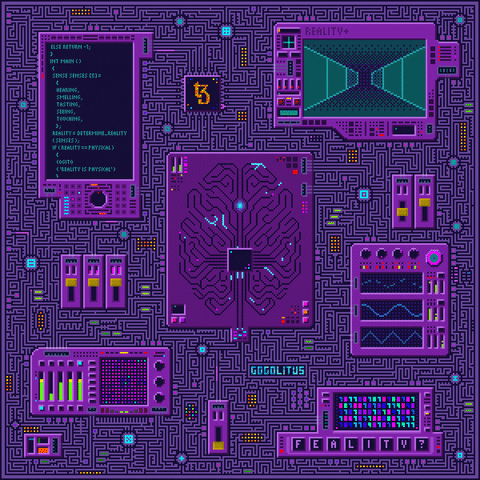

<h1 align="center">
    
</h1>

<h1 align="center">About Me</h1>

<table align="center">
  <tr>
    <td align="center" width="96">
        
       JavaScript
    <td align="center" width="96"> 
        
     Github
    <td align="center" width="96"> 
        
     Python
    <td align="center" width="96"> 
        
     Django
    <td align="center" width="96"> 
        
     Docker
    <td align="center" width="96"> 
        
     Kubernetes
    <td align="center" width="96"> 
        
     AWS
    <td align="center" width="96">
        
     SQL
    </td>
  </tr>
</table>
  

  

I'm very aware of my surroundings and problems. I'm trying to be more open about it but also make it joke to make myself feel better. Please if you see something here and want to reach out feel free to contact me via email. I'm the very definition of "out of sight, out of mind."

<h1 align="center">My Brain runs like...</h1>
    

        
    
 
With no QA team

<!-- **************************************************************** Socials **************************************************************** -->

  
<h1 align="center">Socially Active</h1>

  &#8287;&#8287;&#8287;&#8287;&#8287;
  
  &#8287;&#8287;&#8287;&#8287;&#8287;
  
  &#8287;&#8287;&#8287;&#8287;&#8287;
  
